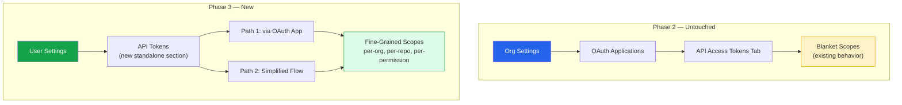
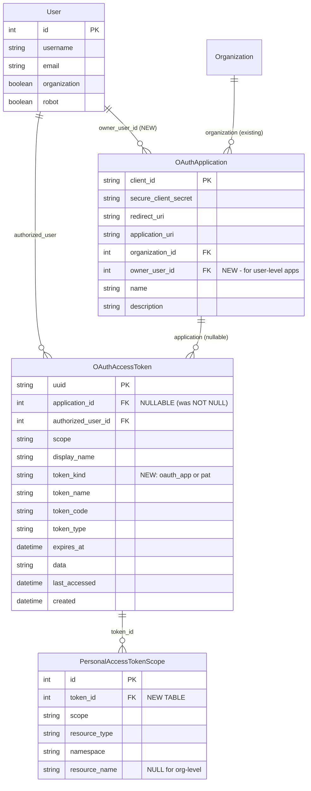

# PROJQUAY-6385 — User Self-Service API Token Management

**Jira:** [PROJQUAY-6385](https://redhat.atlassian.net/browse/PROJQUAY-6385)  

---

## Table of Contents

1. [Problem Statement](#1-problem-statement)
2. [Acceptance Criteria](#2-acceptance-criteria)
3. [Solution Proposal](#3-solution-proposal)
4. [Key Design Decisions](#4-key-design-decisions)
5. [User Journeys](#5-user-journeys)

---

## 1. Problem Statement

### 1.1 Executive Summary

Red Hat Quay's current token management model poses a significant supply-chain security risk on quay.io. Users cannot create fine-grained, repository-scoped API tokens. Instead, all tokens are blanket-scoped — a single `repo:read` token grants read access to **every repository** across **every organization** the user belongs to. Combined with the fact that many users select broad scopes like `org:admin` for CI/CD convenience, this means a single compromised token on a developer's laptop could grant an attacker full administrative access to critical infrastructure images (including OCP release images in the `openshift` organization on quay.io).

### 1.2 The Three Core Problems

#### Problem 1: Tokens Are Too Powerful (No Per-Resource Scoping)

Today's OAuth scopes are **namespace-wide**. When a user selects a scope during token authorization, that scope applies globally:

| Scope Selected | What the User Expects | What Actually Happens |
|---|---|---|
| `repo:read` | "Read access to my team's repo" | Read access to **every repo** visible to the user across **all orgs** |
| `repo:write` | "Push images to our CI repo" | Push access to **every repo** the user can write to, everywhere |
| `org:admin` | "Manage my team's org" | Full admin over **every org** the user belongs to, including `openshift` |

There is **no mechanism** to say: "This token can only read `myorg/myrepo` and nothing else."


#### Problem 2: Only Organization Admins Can Manage Tokens

Token creation today requires navigating to **Organization Settings → Applications → Create OAuth Application → Generate Token**. This flow requires the `org:admin` role. Regular developers who simply need a pull token for their CI pipeline must:

1. Ask an org admin to create an OAuth Application
2. Wait for the admin to set it up
3. Then authorize it themselves

This does not scale for large organizations with hundreds of developers.

#### Problem 3: Token Creation Requires OAuth Application Expertise

Before a user can get a token, someone must first create an "OAuth Application" with a `client_id`, `client_secret`, `redirect_uri`, and `application_uri`. This is the standard OAuth 2.0 setup — appropriate for third-party integrations, but **hostile UX** for a developer who just wants an API key for their personal scripts.

### 1.3 The Architecture Root Cause

The fundamental issue is the **data model coupling**:

```
Token (OAuthAccessToken) 
  → belongs to → OAuthApplication (non-nullable FK) 
    → belongs to → Organization (QuayUserField FK to User where organization=True)
```

This chain enforces three constraints that this Phase 3 feature implementation must break:

1. Every token MUST be tied to an OAuth Application
2. Every OAuth Application MUST be tied to an Organization
3. Scopes are stored as flat strings (`"repo:read repo:write"`) with no resource binding

---

## 2. Acceptance Criteria


#### 2.1 Token Creation

- Users can manage API tokens in their user account:
  - **Path 1 (OAuth Application flow):** They can create tokens in the context of an OAuth application following the existing "Application" concept from organizations (including application name, callback URL, etc.)
  - **Path 2 (Simplified flow):** They can create tokens alternatively using a simpler flow that only captures mandatory information: human-readable token name and optionally an expiry date
  - They can see a list of all tokens (both active and expired) as opposed to just a list of applications


#### 2.2 Organization Scoping

- Users can optionally limit API tokens to a single organization or a subset of organizations
  - The **default org scope** when creating a new token is **a single organization** selected by the user
  - Tokens spanning multiple organizations or all organizations require an explicit opt-in
  - When a user selects more than one org, or selects "All organizations I belong to," the UI displays a security notice:

#### 2.3 Repository Scoping

- Users can optionally limit API tokens to **specific repositories** within the selected organization(s)
  - The **default** is "all accessible repositories in the selected org(s)" → no change to existing behavior
  - Users can select individual repositories to **narrow** the token's scope
  - Repository-scoped tokens only grant access to the listed repos, even if the user has broader access within that org

#### 2.4 Permission Scoping

- Users can optionally scope API tokens to a subset of permissions:
  - Organization management (CRUD access to robots, teams, membership and all org-level properties including org lifecycle) on existing orgs
  - Repository management (CRUD access to robots, teams and user and all repo-level properties including repo lifecycle) on existing repos
  - Organization creation
  - Repository creation
  - Repository read-access (view and pull)
  - Repository write-access (read/write to any accessible repositories)
  - User account administration
  - User account read-access

#### 2.5 Escalation Prevention

- User-managed API tokens are always naturally limited by the permissions of the users owning the token:
  - The UI will **not allow** selecting more permissions than the user currently has
  - When user permissions are reduced over time, this affects the permission scope of the tokens owned by this user as well

#### 2.6 Token Management UI

- Users will get a section in the UI to manage their API tokens, including:
  - Getting a list of existing tokens, with their name, scope, expiry date, and when last used
  - The ability to view the details of a particular token (and its OAuth application data if present)
  - The ability to refresh tokens in-place (shorthand for invalidating an existing token and recreating it with the same scope, name, settings, etc.)
  - The ability to delete tokens
  - The ability to change the expiry date of tokens (including expiring it right away)
- This user UI is supplemented by a new API

#### 2.7 Phase 2 Relationship

- Phase 3 builds on Phase 2 UI components:
  - The token list table reuses the Phase 2 component (Name, Created By, Scopes, Expires, Last Used, Actions columns)
  - The "Create Token" wizard reuses the Phase 2 wizard, extended with the org-scope selector
  - **No changes** are made to Phase 2's "Org Settings → OAuth Applications → API Access Tokens tab"

#### 2.8 Audit & Separation

- Tokens created in User Settings are labeled **"User Token"** in **audit logs** to distinguish them from org-admin tokens created via OAuth Applications (Phase 2)
- The "User Settings → API Tokens" page is a **new, standalone section**, clearly separated from Org Settings; there is no UI overlap or duplication with Phase 2

#### 2.9 Defaults & Enforcement

- The simplified token creation flow (name + expiry only, no OAuth application setup required) defaults the org scope to a **single organization**
- Token permissions can **never exceed** the creating user's permissions in the selected organization(s), enforced at the API level, not only at the UI level

#### 2.10 Resolved Open Questions

| Question | Resolution |
|---|---|
| Should we fold in organization application UI screens into the new user-based token management? | **No.** Phase 2 (PROJQUAY-9755) owns the organization-level token management UI. Phase 3 does not modify or replace that surface. |



---

## 3. Solution Proposal

### 3.1 High-Level Architecture

Phase 3 introduces **Personal Access Tokens (PATs)** — tokens that belong directly to a user, support per-resource permission scoping, and do not require an OAuth Application intermediate.

**Key capabilities:**
1. Any authenticated user can create, list, and revoke their own tokens
2. Tokens can be scoped to specific organizations and/or repositories
3. Each resource binding carries a specific permission level (read, write, admin)
4. A simplified creation flow: name + expiry + scope selections (no OAuth App setup)
5. An optional OAuth Application flow for users who need third-party integrations
6. Multi-org support with security warnings for broad-scope tokens


### 3.1a Co-existence: PATs and Existing OAuth Application Tokens

Phase 3 PATs co-exist side by side with existing org-level OAuth Application tokens in the same `OAuthAccessToken` table:

| Aspect | Org OAuth App Tokens (Phase 2) | User PATs (Phase 3) |
|---|---|---|
| `token_kind` | `'oauth_app'` | `'pat'` |
| Created where | Org Settings → OAuth Applications | User Settings → API Tokens |
| Who creates | Org admins | Any authenticated user |
| Scope model | Blanket (existing, unchanged) | Fine-grained (per-org, per-repo) |
| `application` FK | NOT NULL (linked to org OAuth app) | NULL (Path 2) or set (Path 1) |
| Management UI | Phase 2 (unchanged) | Phase 3 (new) |
| Audit label | Org-admin token | "User Token" |

**Key rules:**
- Creating a PAT does NOT affect any existing OAuth app tokens — they are independent records
- Both are valid for API and Docker auth — the difference is how scopes are enforced
- Org admins have "two hats": they manage org tokens in Org Settings, and their own PATs in User Settings
- An org admin's PAT scoped to `repo:read` on one repo cannot push — even though the admin has full org access (the PAT's scope is the ceiling)

### 3.2 Data Model Changes

#### 3.2.1 Modified Table: `OAuthAccessToken`

Make the `application` foreign key **nullable** to allow tokens without an associated OAuth Application:

```sql
ALTER TABLE oauthaccesstoken 
  ALTER COLUMN application_id DROP NOT NULL;
```

Add a `token_kind` discriminator column to distinguish token types:

```sql
ALTER TABLE oauthaccesstoken
  ADD COLUMN token_kind VARCHAR(20) NOT NULL DEFAULT 'oauth_app';
  -- Values: 'oauth_app' (existing), 'pat' (Phase 3)
```

**Rationale for nullable `application` vs. hidden system app:**
- Option A (hidden system app per user): Creates artificial OAuthApplication records polluting the applications list, complicates queries, obscures the data model
- **Option B (nullable application) — RECOMMENDED**: Clean semantic separation, no phantom data, simpler queries for PATs (`WHERE application IS NULL`), aligns with how GitHub and GitLab model PATs

- **IMPORTANT:** [Refer to Section 7](#7-risk-of-making-application_id-nullable-and-mitigation-plan) for the risk of making `application_id` nullable in the `oauthaccesstoken` table and mitigation plan.


#### 3.2.2 New Table: `PersonalAccessTokenScope`

Stores per-resource permission bindings for PATs:

```sql
CREATE TABLE personalaccesstokenscope (
    id            SERIAL PRIMARY KEY,
    token_id      INTEGER NOT NULL REFERENCES oauthaccesstoken(id) ON DELETE CASCADE,
    scope         VARCHAR(80) NOT NULL,       -- e.g. 'repo:read', 'repo:write', 'org:admin'
    resource_type VARCHAR(20) NOT NULL,       -- 'repository' or 'organization'
    namespace     VARCHAR(255) NOT NULL,      -- org name (e.g. 'myorg')
    resource_name VARCHAR(255) NULL,          -- repo name (NULL if resource_type='organization')
    
    -- Composite index for enforcement lookups
    INDEX idx_pat_scope_lookup (token_id, resource_type, namespace, resource_name)
);
```

**Design rationale:** A separate table (Option B from the architecture gaps analysis) rather than encoding resources in the scope string because:
- Queryable: "Show me all tokens with access to repo X" is a simple SQL query
- Extensible: Adding new resource types (e.g., teams, builds) doesn't change the schema
- No string-length explosion: Tokens scoped to 100 repos don't create a 10KB scope string
- Cleaner enforcement: The permission layer can do a `WHERE token_id = ? AND namespace = ? AND resource_name = ?` check

#### 3.2.3 Modified Table: `OAuthApplication` (for Path 1 only)

To support user-level OAuth Applications (Path 1 from acceptance criteria):

```sql
ALTER TABLE oauthapplication
  ADD COLUMN owner_user_id INTEGER NULL REFERENCES "user"(id);
```

When `owner_user_id` is set, the application belongs to a user (not an org). When NULL, the existing `organization` FK is used (backward compatible).

#### 3.2.4 Entity Relationship Diagram



**Scope enforcement rule:**
```
token_kind = 'oauth_app' → Blanket scope enforcement (existing, unchanged)
token_kind = 'pat'       → Fine-grained enforcement via PersonalAccessTokenScope
                            (applies to BOTH Path 1 and Path 2 tokens)
```

### 3.3 API Design

#### 3.3.1 New User Token Endpoints

All endpoints are under `/api/v1/user/tokens` and require authentication (no specific scope — any authenticated user).

```
GET    /api/v1/user/tokens
       → List all PATs for the authenticated user
       Query params: ?scope=repo:read (filter by scope)
                     ?namespace=myorg (filter by org)
                     ?page=1&per_page=50 (pagination)
       Response: [{uuid, display_name, scopes: [{scope, resource_type, namespace, resource_name}], 
                   expires_at, last_accessed, created, token_kind}]

POST   /api/v1/user/tokens
       → Create a new PAT
       Body: {
         "display_name": "My CI token",
         "expiration": 2592000,  // seconds (30 days)
         "scopes": [
           {"scope": "repo:read", "resource_type": "repository", "namespace": "myorg", "resource_name": "myrepo"},
           {"scope": "repo:write", "resource_type": "repository", "namespace": "myorg", "resource_name": "other-repo"},
           {"scope": "org:admin", "resource_type": "organization", "namespace": "teamorg"}
         ]
       }
       Response: {uuid, display_name, token: "<opaque-token-placeholder-starting-with-quay_pat_>", scopes: [...], expires_at, created}
       NOTE: Raw token is returned ONCE in this response, never again.

GET    /api/v1/user/tokens/{token_uuid}
       → Get details of a specific PAT
       Response: {uuid, display_name, scopes: [...], expires_at, last_accessed, created,
                  application: {name, client_id, ...} | null}

DELETE /api/v1/user/tokens/{token_uuid}
       → Revoke a specific PAT

PATCH  /api/v1/user/tokens/{token_uuid}
       → Update token metadata (display_name, expiration)
       → NOTE: Scopes CANNOT be modified after creation (security decision)

POST   /api/v1/user/tokens/{token_uuid}/refresh
       → Refresh/rotate a token (generates new token value, same scopes)
       Response: {uuid, token: "<opaque-token-placeholder-starting-with-quay_pat_>", expires_at}
```

#### 3.3.2 User OAuth Application Endpoints (Path 1)

For Path 1 (user-level OAuth apps):

```
GET    /api/v1/user/applications
POST   /api/v1/user/applications
GET    /api/v1/user/applications/{client_id}
DELETE /api/v1/user/applications/{client_id}
GET    /api/v1/user/applications/{client_id}/tokens
POST   /api/v1/user/applications/{client_id}/tokens
DELETE /api/v1/user/applications/{client_id}/tokens/{token_uuid}
```

These mirror the existing organization-level endpoints but scoped to the user.

### 3.4 Token Prefix Convention

PATs should have a distinguishable prefix for security scanning and identification:

```
Existing OAuth tokens:  <no prefix> (plain 40-char random strings — confirmed in codebase)
Phase 3 PATs:           quay_pat_<40_char_random>
```

This enables:
- **GitHub Secret Scanning:** GitHub runs automated scanners on every public commit looking for patterns that match known token prefixes (e.g., `ghp_` for GitHub PATs, `glpat-` for GitLab PATs). Quay could register `quay_pat_` with the [GitHub Secret Scanning Partner Program](https://docs.github.com/en/code-security/secret-scanning/secret-scanning-partner-program), enabling automatic detection and notification when Quay PATs are leaked in public repositories.
- Quick visual identification in logs and debug output
- Programmatic distinction between token types without a database lookup

### 3.5 Scope Enforcement (Runtime)

This is the most critical and complex part of the implementation.

#### 3.5.1 Current Enforcement Flow

```
API Request with Bearer token
  → auth/auth_context.py: validate_oauth_token() identifies the user + scopes
  → auth/permissions.py: QuayDeferredPermissionUser loads permissions lazily
    → _populate_repository_provides(): loads repo-level permissions from DB
      → _repo_role_for_scopes(): caps the role based on token's scope set
        → SCOPE_MAX_REPO_ROLES[scope] → maximum role string
  → Flask-Principal: permission.can() checks loaded needs against requirements
```

**The injection point:** `_repo_role_for_scopes()` in `auth/permissions.py` (called around line 258 inside `_populate_repository_provides()`). Currently, this method applies a blanket cap:

```python
# Pseudocode of current behavior:
def _repo_role_for_scopes(self, role):
    # For EVERY repo, cap the role based on the token's scope set
    max_role = max(SCOPE_MAX_REPO_ROLES[s] for s in self.token_scopes)
    return min(role, max_role)  # cap at whatever the scope allows
```

#### 3.5.2 Phase 3 Enforcement Changes

For PATs (`token_kind = 'pat'`), add a **resource binding check** before the blanket scope cap:

```python
# Pseudocode of Phase 3 behavior:
def _repo_role_for_scopes(self, namespace, repo_name, role):
    if self.token_kind == 'pat':
        # Check if this specific (namespace, repo_name) is in the token's resource bindings
        binding = self._get_pat_scope_binding(namespace, repo_name)
        if binding is None:
            # Also check for org-level wildcard: if the token has an org-level scope
            # for this namespace, allow it
            org_binding = self._get_pat_org_binding(namespace)
            if org_binding is None:
                return None  # No access — this repo is not in the token's scope
            binding = org_binding
        # Cap at the binding's scope level
        max_role = SCOPE_MAX_REPO_ROLES[binding.scope]
        return min(role, max_role) if max_role else None
    else:
        # Existing behavior for oauth_app tokens — blanket cap
        max_role = max(SCOPE_MAX_REPO_ROLES[s] for s in self.token_scopes)
        return min(role, max_role)
```

**Performance consideration:** PAT scope lookups must be efficient. Options:
- Eager load all `PersonalAccessTokenScope` records when the token is validated (good for tokens with few scopes)
- Cache scope bindings in a dictionary keyed by `(namespace, resource_name)` for O(1) lookup
- For tokens with many scopes (100+), consider a Redis cache

#### 3.5.3 Docker Auth Flow Enforcement

Docker registry v2 authentication goes through a separate endpoint that issues short-lived JWT bearer tokens. This flow:

```
docker pull myorg/myrepo:latest
  → GET /v2/ → 401 with WWW-Authenticate header
  → GET /v2/auth?scope=repository:myorg/myrepo:pull → Bearer JWT
  → GET /v2/myorg/myrepo/manifests/latest with Bearer JWT
```

The `/v2/auth` endpoint validates the OAuth token and checks if it has the required scope for the requested repository. **Phase 3 will add per-resource filtering here too** — when the OAuth token is a PAT, verify that `(myorg, myrepo)` is in the token's `PersonalAccessTokenScope` bindings before issuing the JWT bearer token.

### 3.6 Alembic Migration

We will have to do an alembic migration which would:
1. Make application nullable on oauthaccesstoken
2. Add token_kind discriminator
3. Create PersonalAccessTokenScope table
4. Add owner_user_id to oauthapplication (for Path 1)


---

## 4. Key Design Decisions

### Decision 1: Nullable `application` FK vs. Hidden System App

| Criteria | Nullable FK (Recommended) | Hidden System App |
|---|---|---|
| Data model clarity | Clean — PATs have no application | Artificial phantom records |
| Query simplicity | `WHERE application IS NULL AND token_kind='pat'` | Must filter out system apps from app listings |
| Migration risk | Medium — must audit all code assuming non-null application | Low — no schema change |
| GitHub/GitLab precedent | Both use separate PAT models | No major platform uses this pattern |

**Decision: Use nullable `application` FK with `token_kind` discriminator.**

All code paths that currently assume `OAuthAccessToken.application` is non-null must be audited and updated. A `token_kind` field makes it easy to branch logic.

### Decision 2: Per-Resource Scope Storage

| Criteria | Separate Table (Recommended) | Encoded in Scope String |
|---|---|---|
| Queryability | "Find all tokens accessing repo X" | Requires LIKE '%myorg/myrepo%' |
| Scalability | Efficient joins and indexes | String length grows with # of repos |
| Extensibility | Add new resource types via new rows | Scope string format becomes complex |
| Enforcement performance | O(1) hash lookup after eager load | Parsing on every request |

**Decision: Use `PersonalAccessTokenScope` table.**

### Decision 3: Scope Immutability After Creation

**Decision: Token scopes CANNOT be modified after creation.** Users must create a new token if they need different scopes.

**Rationale:**
- Security: Prevents privilege escalation on an existing, possibly compromised token
- Audit trail: The scopes at creation time are the scopes for the token's lifetime
- Simplicity: Avoids complex "scope diff" logic and race conditions
- GitHub precedent: GitHub fine-grained PATs are also immutable after creation

### Decision 4: Token Prefix for Detection

**Decision: Use `quay_pat_` prefix for all Phase 3 PATs.**

This enables:
- Secret scanning tools (GitHub, GitLab, Trufflehog) to detect leaked Quay PATs
- Quick visual identification in logs and debug output
- Programmatic distinction between token types without a database lookup

### Decision 5: Org-Level vs. Repo-Level Scoping

**Decision: Support BOTH org-level and repo-level scoping.**

- **Org-level scope:** "repo:read on ALL repos in orgA (current and future)" — stored as `resource_type='organization'`, `resource_name=NULL`
- **Repo-level scope:** "repo:read on orgA/myrepo ONLY" — stored as `resource_type='repository'`, `resource_name='myrepo'`

When both exist for the same namespace, the more specific (repo-level) takes precedence.

### Decision 5a: Scope Combination Examples

The following examples show how `PersonalAccessTokenScope` rows map to different access patterns:

**Scenario A: Specific repos only**
Token has `repo:read` on `myorg1/myrepo1`, `myorg1/myrepo2`, and `myorg2/myrepo3`:

| token_id | scope | resource_type | namespace | resource_name |
|---|---|---|---|---|
| token_1 | repo:read | repository | myorg1 | myrepo1 |
| token_1 | repo:read | repository | myorg1 | myrepo2 |
| token_1 | repo:read | repository | myorg2 | myrepo3 |

*Result:* Can pull from exactly these 3 repos. Nothing else.

**Scenario B: All repos in selected orgs**
Token has `repo:write` on ALL repos across two orgs:

| token_id | scope | resource_type | namespace | resource_name |
|---|---|---|---|---|
| token_2 | repo:write | organization | myorg1 | NULL |
| token_2 | repo:write | organization | myorg2 | NULL |

*Result:* `resource_type=organization` + `resource_name=NULL` means "all repos in this org (current AND future)." The user selects each org explicitly — there is no "all orgs" wildcard.

**Scenario C: All repos in one org only**

| token_id | scope | resource_type | namespace | resource_name |
|---|---|---|---|---|
| token_3 | repo:write | organization | myorg1 | NULL |

*Result:* Can push to any repo in myorg1 (current and future). Cannot access myorg2.

**Scenario D: Org-wide read + admin on one specific repo**

| token_id | scope | resource_type | namespace | resource_name |
|---|---|---|---|---|
| token_4 | repo:read | organization | myorg1 | NULL |
| token_4 | repo:admin | repository | myorg1 | critical-repo |

*Result:* Read all repos in myorg1. Admin only on `critical-repo`. **Resolution rule:** Repo-level binding overrides org-level binding for that specific repo (more-specific wins).

**Scenario E: Full org management**

| token_id | scope | resource_type | namespace | resource_name |
|---|---|---|---|---|
| token_5 | org:admin | organization | myorg1 | NULL |

*Result:* Full admin on myorg1 (create/delete repos, manage teams, manage robots). No access to myorg2.

### Decision 6: Multi-Org Token Support

**Decision: A single PAT can cover resources in multiple organizations.**

**UI mitigation:** When a user creates a token spanning 2+ orgs, display a warning:

> ⚠️ This token will have access to resources in multiple organizations: orgA, orgB. A single compromised token would affect all listed organizations. Consider creating separate tokens per organization for better security isolation.

### Decision 7: Feature Flag Strategy

**Decision: Gate behind `FEATURE_USER_PAT` (default: `false`).**

This allows:
- Incremental rollout on quay.io
- Self-hosted customers to opt-in when ready
- Easy rollback if issues are discovered

### Decision 8: Escalation Prevention

**Decision: Users cannot create a PAT with permissions exceeding their own access level on any targeted resource.**

Extend the Phase 2 `_can_mint_scope()` pattern:
- For each scope + resource binding, verify the user's actual permission on that resource
- If the user has `repo:read` on `myorg/myrepo`, they cannot create a PAT with `repo:admin` on `myorg/myrepo`
- If the user has no access to `otherorg/secretrepo`, they cannot create a PAT targeting it

**Scope vs. Permission — key distinction:**
```
SCOPE      = What the TOKEN is allowed to do (ceiling set at token creation)
PERMISSION = What the USER is actually allowed to do (from org/team/repo membership)

Effective access = min(scope, permission)
```
Scopes can only *reduce* access, never *increase* it.

**Escalation prevention matrix:**

| User's actual permission | Requested PAT scope | Result |
|---|---|---|
| `repo:read` on myorg/myrepo | `repo:read` | Allowed |
| `repo:read` on myorg/myrepo | `repo:write` | Rejected (escalation) |
| `repo:read` on myorg/myrepo | `repo:admin` | Rejected (escalation) |
| `repo:write` on myorg/myrepo | `repo:read` | Allowed (downgrade) |
| `repo:write` on myorg/myrepo | `repo:write` | Allowed (exact match) |
| `repo:write` on myorg/myrepo | `repo:admin` | Rejected (escalation) |
| `repo:admin` on myorg/myrepo | `repo:read` | Allowed (downgrade) |
| `repo:admin` on myorg/myrepo | `repo:admin` | Allowed (exact match) |
| No access to otherorg/secretrepo | any scope | Rejected (no access) |
| Org member (not admin) of myorg | `org:admin` on myorg | Rejected (not org admin) |
| Org admin of myorg | `org:admin` on myorg | Allowed |
| Org admin of myorg | `org:admin` on otherorg | Rejected (not admin there) |

**Validation rules at PAT creation:**
1. For each scope+resource binding, check if user has ≥ that permission on that specific resource
2. Use the implied scope hierarchy: `repo:admin` ≥ `repo:write` ≥ `repo:read`
3. If *any* binding fails validation, reject the *entire* PAT creation (not partial)
4. Return a clear error: `"You do not have repo:write permission on myorg/myrepo"`

### Decision 9: Maximum Token Lifetime

**Decision: Configurable maximum, defaulting to 365 days.**

```python
# config.py
PAT_MAX_EXPIRATION_SECONDS = 31536000  # 365 days, configurable
PAT_DEFAULT_EXPIRATION_SECONDS = 2592000  # 30 days
```

The current 10-year default for OAuth tokens is excessive for fine-grained PATs. Organizations should be able to enforce shorter lifetimes.

### Decision 10: Backward Compatibility

**Decision: Existing OAuth Application tokens are completely unaffected.**

- No migration of existing tokens to the PAT model
- The `token_kind` column defaults to `'oauth_app'` for all existing records
- Existing API endpoints (`/v1/organization/{orgname}/applications/{client_id}/tokens`) continue to work unchanged
- Phase 2 UI in Organization Settings is unmodified

---

## 5. User Journeys

### Journey 1: Developer Creates a Read-Only Pull Token

**Persona:** A developer who needs to pull images from `myteam/app-frontend` in their CI pipeline.

**Steps:**
1. User navigates to **User Settings → Personal Access Tokens**
2. Clicks **"Create New Token"**
3. Enters token name: `"CI pipeline pull token"`
4. Sets expiration: `90 days`
5. In the scope selection:
   - Selects organization: `myteam`
   - Selects repository: `app-frontend`
   - Selects permission: `Read (pull only)`
6. Reviews the summary showing the blast radius:
   > This token can: Pull images from `myteam/app-frontend`. No other access.
7. Clicks **"Generate Token"**
8. Copies the displayed token (shown once)
9. Pastes it into their CI pipeline's `QUAY_TOKEN` secret

**Backend flow:**
```
POST /api/v1/user/tokens
{
  "display_name": "CI pipeline pull token",
  "expiration": 7776000,
  "scopes": [
    {"scope": "repo:read", "resource_type": "repository", "namespace": "myteam", "resource_name": "app-frontend"}
  ]
}
```

### Journey 2: DevOps Engineer Creates a Multi-Repo Push Token

**Persona:** A DevOps engineer who needs to push images to 3 repos across 2 orgs.

**Steps:**
1. Navigates to **User Settings → Personal Access Tokens**
2. Clicks **"Create New Token"**
3. Enters name: `"Build pipeline push token"`
4. Sets expiration: `30 days`
5. Adds scopes:
   - `myteam/app-frontend` → Read/Write
   - `myteam/app-backend` → Read/Write
   - `shared-images/base-images` → Read only
6. UI shows multi-org warning:
   > ⚠️ This token spans 2 organizations (myteam, shared-images).
7. Reviews and generates

**Backend flow:**
```
POST /api/v1/user/tokens
{
  "display_name": "Build pipeline push token",
  "expiration": 2592000,
  "scopes": [
    {"scope": "repo:write", "resource_type": "repository", "namespace": "myteam", "resource_name": "app-frontend"},
    {"scope": "repo:write", "resource_type": "repository", "namespace": "myteam", "resource_name": "app-backend"},
    {"scope": "repo:read", "resource_type": "repository", "namespace": "shared-images", "resource_name": "base-images"}
  ]
}
```

### Journey 3: Team Lead Creates an Org-Wide Admin Token

**Persona:** A team lead who needs full admin access to their org for scripting.

**Steps:**
1. Creates a PAT with:
   - Name: `"Org management scripts"`
   - Expiration: `7 days` (short for sensitive scope)
   - Scope: `myteam` (organization) → `org:admin`
2. UI shows elevated-privilege warning:
   > 🔴 This token has ADMIN access to the entire `myteam` organization, including all current and future repositories. Use the shortest practical expiration.
3. Reviews and generates

**Backend flow:**
```
POST /api/v1/user/tokens
{
  "display_name": "Org management scripts",
  "expiration": 604800,
  "scopes": [
    {"scope": "org:admin", "resource_type": "organization", "namespace": "myteam"}
  ]
}
```

### Journey 4: User Views and Revokes a Token

**Steps:**
1. Navigates to **User Settings → Personal Access Tokens**
2. Sees a list of their tokens with columns:
   - Name | Scopes Summary | Expires | Last Used | Created
3. Clicks on a token to see details:
   - All resource bindings with permissions
   - OAuth Application data (if created via Path 1)
   - Last accessed timestamp
4. Clicks **"Revoke"** on an expired or compromised token
5. Confirms revocation in a modal

### Journey 5: Docker Pull With a Scoped PAT

**Persona:** A developer using a PAT scoped to `myteam/app-frontend` (repo:read).

**Success case:**
```bash
$ docker login quay.io -u myuser -p quay_pat_abc123...
Login Succeeded

$ docker pull quay.io/myteam/app-frontend:latest
latest: Pulling from myteam/app-frontend
...
Status: Downloaded newer image
```

**Failure case (out of scope):**
```bash
$ docker pull quay.io/myteam/app-backend:latest
Error response from daemon: unauthorized: access to the requested resource 
is not authorized. Token does not have access to repository myteam/app-backend.
```

**Implementation note:** The v2 auth endpoint must check `PersonalAccessTokenScope` bindings when the OAuth token is a PAT, and return a clear error message indicating the specific resource is not in the token's scope.

### Journey 6: Token Refresh

**Steps:**
1. User navigates to token details
2. Clicks **"Refresh Token"**
3. UI warns: _"This will generate a new token value. The old value will stop working immediately. Are you sure?"_
4. User confirms
5. New token value is displayed (shown once)
6. Old token value is invalidated

**Backend flow:**
```
POST /api/v1/user/tokens/{token_uuid}/refresh
Response: {uuid: same, token: "<opaque-token-placeholder-starting-with-quay_pat_>", expires_at: <extended>}

```

---