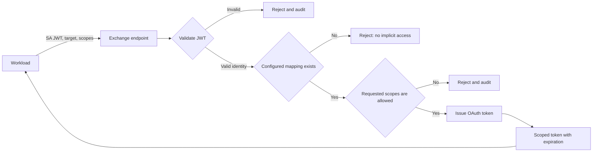
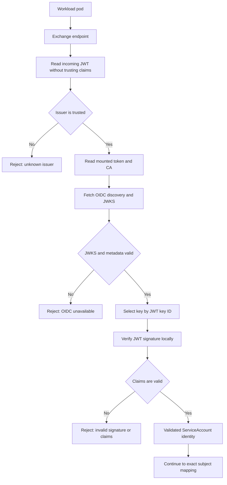
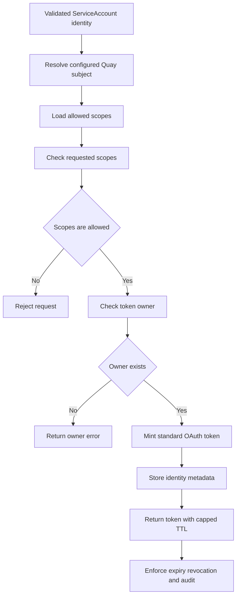

# Workload Identity Authentication for Quay Management API

## 1. Purpose

Build a new endpoint (POST `/api/v1/bootstrap/exchange`) that accepts a Kubernetes ServiceAccount JWT and returns a scoped Quay OAuth token.  Reuse  [PROJQUAY-9856](https://redhat.atlassian.net/browse/PROJQUAY-9856)token-minting model functions.  
No SAR, no CRDs, no K8s RBAC mapping, no wildcards.

### Background
Federated robot accounts brought keyless authentication to registry push/pull, 
but the Management API still requires automation to "masquerade" as a human user. 
If that human leaves or is deactivated in LDAP/AD, the automation breaks. The common 
workaround, a "dummy" human user in the identity provider, consumes a seat license, 
requires bypassing MFA, and violates non-human identity management policies. 
Robot accounts cannot help here because they are restricted to registry operations and cannot 
manage the platform itself. This proposal extends the keyless workload identity pattern to 
the Management API, enabling Kubernetes workloads to authenticate via ServiceAccount identity 
without stored credentials.

## 2. Goals and non-goals

#### Goals

- Authenticate eligible Kubernetes ServiceAccounts to Quay.
- Issue standard Quay OAuth tokens with enforced scopes and normal expiration/revocation behavior.
- Preserve existing human, non-Kubernetes, and programmatic-bootstrap flows.
- Provide auditable success and failure outcomes.

#### Non-goals

- Replacing human authentication.
- Removing programmatic bootstrap in this feature.

## 3. End-to-end architecture

Workload → Quay Management API (new endpoint): presents a ServiceAccount bearer token and requested access.

Quay → Kubernetes API: validates the token through OIDC with the k8s CA.

Quay: resolves the validated identity, applies the selected authorization gate
(administrator-provided mapping), and reuses the existing organization token endpoint/lifecycle.

Quay → Workload: returns a scoped OAuth bearer token, or rejects the request without issuing one.



*Trust boundary: a valid Kubernetes identity is not, by itself, Quay authorization. Quay must apply
an explicit authorization decision before minting a token.*

## 4. RFC 8693-aligned exchange contract

The endpoint remains Quay-specific — `POST /api/v1/bootstrap/exchange` — but follows the OAuth 2.0 Token Exchange request and response parameters defined by [RFC 8693](https://datatracker.ietf.org/doc/html/rfc8693).

The Kubernetes ServiceAccount JWT is the RFC 8693 `subject_token`: it represents the workload identity on whose behalf Quay issues a token. This is distinct from Quay's own pod-mounted ServiceAccount token, which is used only for authenticated OIDC discovery/JWKS retrieval.

The exchange request uses `application/x-www-form-urlencoded` parameters:

- `grant_type` — required; `urn:ietf:params:oauth:grant-type:token-exchange`.
- `subject_token` — required; the presented Kubernetes ServiceAccount JWT.
- `subject_token_type` — required; `urn:ietf:params:oauth:token-type:jwt`.
- `audience` — optional logical target service name; for this endpoint, `quay` is the expected value. This is separate from the Kubernetes JWT's `aud` claim, which is validated against `REQUIRED_AUDIENCE`.
- `resource` — optional absolute URI identifying the target Quay service. If supported, it must be an absolute URI without a fragment, as required by RFC 8693. `audience` and `resource` are target descriptors for the issued token; they are not substitutes for validating the incoming JWT audience.
- `scope` — optional space-delimited requested Quay scopes. The requested values must be a subset of the configured scopes for the exact authorized ServiceAccount subject.
- `requested_token_type` — optional; omitted in the initial profile because the endpoint always issues a standard Quay OAuth access token.

No `actor_token` is used. The workload's SA JWT is the subject token, and the exchange relies on possession of that bearer credential rather than a separate OAuth client credential. Exact `AUTHORIZED_SUBJECTS` matching, issuer validation, audience validation, and scope allow-lists provide the authorization boundary.

Example request:

```http
POST /api/v1/bootstrap/exchange HTTP/1.1
Host: quay.example.com
Content-Type: application/x-www-form-urlencoded

client_id=quay-workload&grant_type=urn%3Aietf%3Aparams%3Aoauth%3Agrant-type%3Atoken-exchange&subject_token=eyJhbGciOiJSUzI1NiIsImtpZCI6ImN...&subject_token_type=urn%3Aietf%3Aparams%3Aoauth%3Atoken-type%3Ajwt&audience=quay&scope=org%3Aadmin%20repo%3Aread%20repo%3Awrite
```

`client_id` is shown only if the deployment chooses to identify the calling workload client separately; it is not required by RFC 8693 and is not a replacement for `subject_token`. If no separate client-authentication mechanism is configured, omit it. The example JWT is intentionally truncated and must never be logged or placed in documentation as a real credential.

Example successful response:

```http
HTTP/1.1 200 OK
Content-Type: application/json

{
  "access_token": "quay-oauth-token-value",
  "issued_token_type": "urn:ietf:params:oauth:token-type:access_token",
  "token_type": "Bearer",
  "expires_in": 3600,
  "scope": "org:admin repo:read repo:write"
}
```

The returned `scope` is the effective scope. It may be narrower than requested after intersecting the request with the exact subject mapping's allowed scope set. `issued_token_type` identifies the returned credential as a normal OAuth access token; `token_type` describes how the caller presents it to Quay.

Example rejection when the subject is valid but requests an unauthorized scope:

```http
HTTP/1.1 403 Forbidden
Content-Type: application/json

{
  "error": "access_denied",
  "error_description": "requested scope is not authorized for the Kubernetes ServiceAccount"
}
```

Example rejection for an invalid or untrusted JWT:

```http
HTTP/1.1 401 Unauthorized
Content-Type: application/json

{
  "error": "invalid_token",
  "error_description": "Kubernetes ServiceAccount token failed validation"
}
```

This is an RFC 8693-aligned profile rather than a generic RFC 8693 Security Token Service: Quay retains its dedicated endpoint, Kubernetes-specific JWT validation, exact subject mapping, and Quay OAuth token lifecycle. It does not support actor/delegation tokens or refresh tokens in the initial profile.

## 5. Validation approach

Quay will validate the SA JWT with the existing OIDC logic.
It validates token is intended for Quay. It does not by itself authorize Quay access; that is the separate
mapping.

### Validation flow

The exchange endpoint validates the workload JWT before performing any authorization mapping or token issuance. The workload's JWT is the credential being validated. Quay's own pod-mounted ServiceAccount token is a separate credential: it authenticates Quay's outbound OIDC discovery and JWKS requests to the Kubernetes API server. The mounted `ca.crt` verifies the API server's TLS certificate.



The JWKS/discovery data should be cached for `JWKS_CACHE_TTL_SECONDS` (1 hour in the example configuration). Quay uses the mounted ServiceAccount token and CA only when it needs to populate or refresh that cache—not for every incoming exchange request. A refresh occurs on cold cache, TTL expiry, or an unknown signing-key `kid`/key-rotation verification failure. The incoming workload JWT is never sent back to Kubernetes for TokenReview; its signature is checked locally against the retrieved JWKS.

The configured issuer and the network URL used to fetch discovery may need to be represented separately in a host-side CRC harness: `https://kubernetes.default.svc` is the JWT issuer inside the cluster, while `https://api.crc.testing:6443` is reachable from the host. In a Quay pod, the configured Kubernetes issuer URL is expected to be directly resolvable.

## 6. Authorization mapping

How should a validated identity map to a Quay subject and allowed Management API scopes?

- Explicit configured mapping: cluster/namespace/ServiceAccount → Quay identity + scopes. Strong
  auditability; more configuration.
- Kubernetes RBAC-driven mapping: aligns with Kubernetes permissions; scope translation is complex and
  may couple systems. 

#### Explicit administrator-controlled mapping (preferred working direction)

Quay validates the ServiceAccount token, then looks up an administrator-created mapping
from cluster identity, namespace, and ServiceAccount to a Quay subject and an allow-list of Quay
scopes. Missing or empty authorization configuration denies the exchange; a valid identity is never
authorized implicitly.

**The mapping must explicitly define:**

- Which cluster or Kubernetes issuer is trusted. (`OIDC_SERVERS`)
- Namespace and ServiceAccount identity (including audience/issuer constraints where required).
- The Quay subject to use, such as a robot account or service identity.
- The permitted Quay organizations, repositories, operations, or Management API scopes.
- Lifecycle, ownership, audit, and revocation behavior.

Example configuration:

```yaml
FEATURE_KUBERNETES_SA_BOOTSTRAP: true
BOOTSTRAP_TOKEN_OWNER: "quay-admin"
SUPER_USERS:
  - "quay-admin"

KUBERNETES_SA_BOOTSTRAP_CONFIG:
  OIDC_SERVERS: 
    - "https://kubernetes.default.svc"
  REQUIRED_AUDIENCE: "quay-bootstrap"
  AUTHORIZED_SUBJECTS:
    - subject: "system:serviceaccount:quay-operator:controller-manager"
      scopes: "org:admin repo:admin repo:create repo:read repo:write"
    - subject: "system:serviceaccount:ci-cd:tekton-pipeline-sa"
      scopes: "org:admin repo:create repo:read repo:write"  
  JWKS_CACHE_TTL_SECONDS: 3600
  BOOTSTRAP_TOKEN_MAX_TTL: 86400  # server-side cap in seconds (caller can request less, never more)

```

Mapping will be part of the quay config.

## 7. Token issuance

Re-use the existing oauth bootstrap feature to mint an oauth token.



Requires an existing super user for ownership of the bootstrap token. Quay will validate that the owner user exists in the DB at exchange time.
If the owner is deleted from the DB Quay will return a clear error.

The workload presents its ServiceAccount JWT together with the target organization and requested
Quay scopes. Quay validates the workload identity, applies the selected authorization gate, checks
that the requested scopes are a subset of the scopes authorized for that identity, and returns a
standard Quay OAuth bearer token with an expiration. The token then follows the existing Quay OAuth
lifecycle, including scope enforcement,
expiration, revocation, and audit behavior.

Mapping a ServiceAccount JWT directly to a Quay robot
identity instead of exchanging the JWT for a scoped OAuth token is not viable. 
Robot accounts only grant push/pull authorization in Quay, which is not enough for the customer's requested use-case.
Direct robot identity use would also give the workload the robot's standing permissions rather than a separately scoped, 
time-limited token.

The requested exchange is more secure when Quay enforces both an administrator-defined maximum scope
set for the workload and the requested scope subset. This provides a least-privilege token boundary
without allowing the workload to grant itself additional Quay access.

## 8. Compatibility and rollout

- Additive feature, gated by FEATURE_KUBERNETES_SA_BOOTSTRAP and off by default.
- Existing authentication and programmatic bootstrap remain functional when workload identity is
  disabled.
- Existing bootstrap credentials and workload identity may coexist during adoption.

## 9. Focused security decisions

- Reject unknown, invalid, expired, or untrusted identities before token issuance.
- Enforce requested scopes against the workload’s authorized scopes; never grant broader access by
  default.
- Preserve token expiration, revocation, and audit behavior.
- Record successful issuance and rejected attempts with enough identity and reason context for
  investigation, without logging bearer tokens.
    - store SA subject in `token.data` field
- Define replay and audience requirements for presented ServiceAccount tokens.
- Exact matches only for `AUTHORIZED_SUBJECTS`, no globbing patterns.

## Test Plan / Acceptance Criteria

- **Unit tests:** Cover the authentication, mapping, scope, and token-issuance logic.
- **Integration tests:** Verify Quay’s interaction with the configured Kubernetes identity-validation
  mechanism and OAuth token store.
- **End-to-end tests:** Validate the complete workload flow in a supported Kubernetes deployment:
  - A configured ServiceAccount can exchange its JWT for a standard Quay OAuth token.
  - The token can perform authorized Management API operations.
  - The token cannot perform operations outside its granted scopes.
  - Invalid, expired, wrong-audience, and unauthorized ServiceAccount tokens are rejected.
  - Requests fail closed when identity validation or authorization is unavailable.
  - Token expiration, revocation, and audit behavior work as expected.
  - Existing programmatic bootstrap, human authentication, and non-Kubernetes flows remain unaffected.
  - Missing token owner in DB throws clear error.
  - ServiceAccounts from multiple clusters can exchange their tokens with Quay (not limited to single-cluster usecase).
- **Release confidence:** Test coverage includes upgrade/rollback or version-skew scenarios relevant
  to the supported deployment model, and the workload-consumer and administrator documentation is
  sufficient to configure and troubleshoot the feature.

The core shipping bar is:

> A real Kubernetes workload can obtain a scoped Quay OAuth token, use it successfully within its
authorization boundary, and is reliably denied outside that boundary—without regressing existing
authentication flows.

## Assumptions to validate
Pending validation with customer:
- Single cluster?  → Do their K8s workloads run on the same cluster as Quay, or do they have cross-cluster scenarios?
(Assuming cross cluster for now)
- Which operations?  → Beyond org/repo/robot/federation provisioning, do they need superuser-level operations?
- How many SAs?  → Small set (operator + CI) or large dynamic set? Exact match should be fine for the former.
- Coarse scopes OK?  → org:admin grants everything in the org. Fine-grained scoping (RFE-9574) is a separate initiative. Is this acceptable for now?
- Token TTL?  → Is 24h the right cap? What are their automation patterns (hourly reconciliation vs. daily batch)?
- Non-K8s automation? → If they also run Terraform/Ansible outside K8s, those need Phase 1 bootstrap or PROJQUAY-10538 M2M (Quay 3.18), not this feature.

