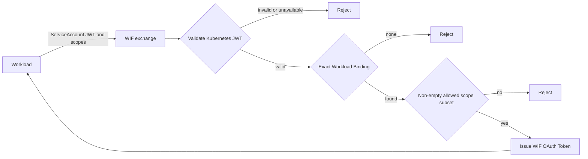

# Workload Identity Authentication for Quay Management API

## 1. Purpose

This proposal adds instance-wide Kubernetes ServiceAccount Workload Identity
Federation (WIF) for the Quay Management API. A Kubernetes workload presents a
projected ServiceAccount JWT to Quay and receives a short-lived, scoped Quay
OAuth bearer token.

This removes the need for automation to impersonate a human administrator.
Human accounts are unsuitable automation identities: they can be deactivated,
require lifecycle management in an external identity provider, may consume
licensed seats, and often need MFA exceptions. Long-lived robot Basic-auth
tokens are also not the answer: they are separate credentials and this design
does not use them for WIF.

The feature is intentionally limited to Kubernetes ServiceAccounts and a
single, instance-wide Quay service identity. It does not introduce a generic
issuer/claims federation framework or organization-scoped WIF.

## 2. Goals and non-goals

### Goals

- Authenticate Kubernetes ServiceAccount JWTs from explicitly trusted issuers.
- Require an explicit, exact workload binding before issuing a token.
- Issue standard Quay OAuth access tokens with normal scope enforcement.
- Use a non-human Quay identity rather than a configured human token owner.
- Preserve programmatic bootstrap and all existing authentication flows.
- Make token exchange and subsequent Management API actions auditable without
  recording bearer credentials.
- Fail closed when identity validation or authorization cannot be completed.

### Non-goals

- Replacing human authentication or existing programmatic bootstrap.
- Organization-scoped workload identity.
- Generic OIDC issuer support or arbitrary claim matching.
- Kubernetes TokenReview, SubjectAccessReview, CRDs, or Kubernetes RBAC to
  Quay-scope translation.
- Wildcard workload identity matching.
- Refresh tokens, actor tokens, client credentials, `audience`, or `resource`
  parameters for exchange.
- A user-facing bulk WIF token-revocation API in the first release.

## 3. Terminology

- **Instance Service Account**: the fixed, non-loginable robot
  `quay-system+wif`. It is the effective authorized user for every WIF OAuth
  token and is an explicit Quay superuser while WIF is enabled.
- **System Organization**: the fixed, non-loginable `quay-system` organization.
  It contains no human owners-team membership and owns WIF system records.
- **WIF OAuth Application**: the internal OAuth application
  `__quay_workload_identity_app`, owned by `quay-system`. It records WIF token
  lifecycle; it is not the effective principal of an issued token.
- **Workload Binding**: a configured, immutable authorization mapping with a
  unique name. It identifies one issuer, Kubernetes namespace, and
  ServiceAccount name and grants an explicit Quay OAuth scope allow-list.
- **Workload Provenance**: safe, verified workload information stored with a
  WIF token and copied to action audit records.

`BOOTSTRAP_TOKEN_OWNER` remains a legacy bootstrap concept. It has no role in
WIF provisioning, token issuance, or lifecycle.

## 4. Architecture

### 4.1 System identity graph

When WIF is enabled, Quay idempotently provisions this fixed graph:

```text
quay-system (System Organization)
└── quay-system+wif (Instance Service Account robot)

quay-system
└── __quay_workload_identity_app (WIF OAuth Application)
```

The robot is marked as an instance-WIF system record. On a later startup, Quay
may reuse reserved records only when this complete linked graph is present and
valid. A partial, mismatched, or tenant-owned graph is a startup failure; Quay
never silently adopts or repairs it. First-time provisioning creates the full
graph atomically.

The System Organization cannot use ordinary organization creation because that
path creates a human owner-team membership. System records are hidden from
tenant-facing listings and UI, and ordinary mutation and deletion are rejected.
They remain protected if WIF is later disabled, so that a re-enable cannot turn
them into tenant-managed records.

While WIF is enabled, ordinary tenant operations cannot create or use the
reserved names. On an instance where WIF has never been enabled, those names
are not proactively reserved. If a legacy or tenant record uses a reserved name
when WIF is enabled later, enablement fails safely.

The Instance Service Account retains its normally generated Robot Token, but
WIF never uses it and no WIF-specific Robot Token API scopes are required.
Robot Basic-auth Management API access is independent work.

### 4.2 Token identity and privilege

Each successful exchange creates a standard Quay OAuth access token with:

- `authorized_user` set to `quay-system+wif`;
- `application` set to `__quay_workload_identity_app`;
- requested effective OAuth scopes; and
- verified Workload Provenance in token data.

The Instance Service Account is recognized as a superuser only while WIF is
enabled; administrators do not add it to `SUPER_USERS`. Existing OAuth
permission behavior still applies: superuser authorization requires the token
to contain `super:user`. The robot's status alone does not bypass OAuth scopes.
`super:user` is allowed only when an exact Workload Binding explicitly grants
it. `direct_user_login` is never valid for WIF.

The WIF OAuth Application is an internal token-lifecycle record, not a general
OAuth client. Standard OAuth authorization and client-credential flows reject
it even if its identifier or generated secret is known. Only the WIF exchange
endpoint can issue tokens through it.

### 4.3 Kubernetes JWT validation

Quay validates the incoming workload JWT locally using OIDC discovery and JWKS
for the configured Kubernetes issuer. The workload JWT is never sent to
Kubernetes TokenReview or another remote token-validation endpoint.

Quay's own mounted ServiceAccount bearer token and CA certificate are separate
credentials. Quay uses them only to authenticate and secure its outbound
Kubernetes discovery/JWKS requests. They are not the workload identity.

Validation requires:

- a configured, trusted issuer;
- HTTPS, no redirects, and a JWKS endpoint constrained to the discovery
  document's origin;
- a valid JWT signature using the issuer's JWKS;
- internally consistent Kubernetes ServiceAccount claims;
- a configured deployment-specific JWT audience; and
- valid JWT lifetime.

Discovery and JWKS are cached. Static WIF configuration is validated at
startup, but discovery/JWKS retrieval is lazy so a temporary Kubernetes API
outage does not prevent Quay from starting. An exchange fails closed when keys
or discovery cannot be obtained or validated.

The identity selector is issuer plus Kubernetes namespace and ServiceAccount
name. It intentionally does not pin the ServiceAccount UID. An issuer,
namespace, and ServiceAccount name tuple may have exactly one binding.

### 4.4 Authorization and issuance

A valid Kubernetes identity is not Quay authorization. Quay finds one exact
Workload Binding and verifies that every requested scope is in its explicit
allow-list. There are no default scopes, no wildcard matches, and no scope
union across bindings.

WIF may be enabled with zero bindings to support staged deployment. In that
state the system graph exists but every exchange is denied until an
administrator adds a binding.

The incoming JWT must have at least 60 seconds of validated remaining lifetime.
The issued OAuth token has no refresh token and expires at the earlier of:

1. 3600 seconds after issuance; or
2. the incoming ServiceAccount JWT expiry.

Removing a binding blocks new exchanges immediately. Existing WIF tokens remain
valid until their normal expiry. Disabling WIF likewise blocks new exchanges but
does not revoke or delete existing WIF tokens; they remain valid for at most
one hour. Disabling does not delete the system graph.


```mermaid
flowchart LR
    W[Workload] -->|ServiceAccount JWT and scopes| E[WIF exchange]
    E --> V{Validate Kubernetes JWT}
    V -->|invalid or unavailable| R1[Reject]
    V -->|valid| B{Exact Workload Binding}
    B -->|none| R2[Reject]
    B -->|found| S{Non-empty allowed scope subset}
    S -->|no| R3[Reject]
    S -->|yes| T[Issue WIF OAuth Token]
    T --> W
```

## 5. Exchange contract

`POST /api/v1/workload/exchange` is a Quay-specific,
[RFC 8693](https://datatracker.ietf.org/doc/html/rfc8693)-aligned token-exchange
profile. It is not a general Security Token Service.

The request uses `application/x-www-form-urlencoded` and permits only:

- `grant_type` (required):
  `urn:ietf:params:oauth:grant-type:token-exchange`
- `subject_token` (required): Kubernetes ServiceAccount JWT
- `subject_token_type` (required):
  `urn:ietf:params:oauth:token-type:jwt`
- `scope` (required): non-empty, space-delimited Quay OAuth scope subset

The endpoint rejects unsupported parameters including `audience`, `resource`,
`actor_token`, refresh-token parameters, `client_id`, and client secrets.

Example request:

```http
POST /api/v1/workload/exchange HTTP/1.1
Host: quay.example.com
Content-Type: application/x-www-form-urlencoded

grant_type=urn%3Aietf%3Aparams%3Aoauth%3Agrant-type%3Atoken-exchange&subject_token=eyJhbGciOiJSUzI1NiIsImtpZCI6Im...&subject_token_type=urn%3Aietf%3Aparams%3Aoauth%3Atoken-type%3Ajwt&scope=super%3Auser
```

Example response:

```http
HTTP/1.1 200 OK
Content-Type: application/json

{
  "access_token": "quay-oauth-token-value",
  "issued_token_type": "urn:ietf:params:oauth:token-type:access_token",
  "token_type": "Bearer",
  "expires_in": 1800,
  "scope": "super:user"
}
```

`expires_in` reflects the actual shorter lifetime when the ServiceAccount JWT
expires before the 3600-second WIF maximum. The example credential is
intentionally truncated. Neither it nor a real JWT may be logged.

Expected rejection classes include `invalid_request` for malformed or
unsupported requests, `invalid_grant` for an invalid, expired, wrong-audience,
or too-short-lived ServiceAccount JWT, and `access_denied` for no matching
binding or an unauthorized requested scope.

## 6. Configuration

WIF uses an independent feature flag and configuration, separate from legacy
programmatic bootstrap. The configuration contains trusted Kubernetes issuer
information, a deployment-specific required JWT audience, discovery/JWKS cache
settings, and Workload Bindings.

Illustrative configuration:

```yaml
FEATURE_KUBERNETES_SERVICE_ACCOUNT_WIF: true
KUBERNETES_SERVICE_ACCOUNT_WIF_CONFIG:
  OIDC_SERVERS:
    - "https://kubernetes.default.svc"
  REQUIRED_AUDIENCE: "quay-management-api"
  JWKS_CACHE_TTL_SECONDS: 3600
  WORKLOAD_BINDINGS:
    - NAME: "quay-operator-controller"
      ISSUER: "https://kubernetes.default.svc"
      NAMESPACE: "quay-operator"
      SERVICE_ACCOUNT: "controller-manager"
      SCOPES:
        - "super:user"
```

Binding names are required, immutable, and unique. The issuer/namespace/
ServiceAccount identity tuple is also unique. The configuration rejects empty
scope allow-lists and `direct_user_login`.

The final schema field spelling follows Quay configuration conventions; this
example specifies the required semantics rather than a final serialized schema.

## 7. Audit and asynchronous work

At exchange time, Quay stores only safe verified provenance in the OAuth token:

- Instance Service Account;
- issuer;
- normalized Kubernetes ServiceAccount subject;
- Workload Binding name;
- OAuth token UUID; and
- effective scope.

Central action logging copies this provenance for Management API actions
performed synchronously with the token. It never stores or logs the source JWT
or returned OAuth secret.

Request-local OAuth context is unavailable to background workers. Therefore a
WIF-authenticated API path may enqueue asynchronous work only when its job
payload or persisted task metadata explicitly carries safe Workload Provenance.
An asynchronous path that cannot preserve provenance rejects WIF authentication
until it is updated.

## 8. Compatibility and rollout

The feature is additive and disabled by default. It does not change existing
human authentication, robot registry authentication, robot Basic-auth API work,
or programmatic bootstrap. Bootstrap retains its feature/configuration,
`__quay_bootstrap_app`, endpoint, ownership, cleanup, and audit lifecycle.

Rollout sequence:

1. Configure issuer discovery, required audience, and zero or more bindings.
2. Enable WIF; Quay atomically provisions and validates the protected system
   identity graph.
3. Add exact bindings in a staged deployment, beginning with least privilege.
4. Monitor exchange and action audit records.
5. Disable WIF to stop new exchanges if necessary; existing tokens naturally
   expire within one hour.

## 9. Test plan and acceptance criteria

### Unit and integration coverage

- Validate issuer, signature, JWKS refresh/key rotation, audience, expiry, and
  internally consistent Kubernetes ServiceAccount claims.
- Verify no workload JWT is sent to TokenReview.
- Verify cache misses and Kubernetes discovery/JWKS failures fail closed while
  startup remains possible.
- Verify exact matching, required unique binding names and identity tuples,
  no wildcard or union behavior, zero-binding behavior, and scope-subset
  enforcement.
- Reject omitted/empty scopes, unsupported exchange parameters, and
  `direct_user_login`.
- Verify `super:user` works only when explicitly bound and the Instance Service
  Account is recognized as superuser while WIF is enabled.
- Verify source JWT lifetime cap, 60-second minimum remaining lifetime, 3600
  second maximum, and no refresh token.
- Verify first provisioning is atomic; valid graphs are reused; partial,
  mismatched, and tenant-collision graphs fail safely.
- Verify system records are hidden/protected and WIF OAuth Application rejects
  ordinary OAuth flows.
- Verify WIF tokens use the Instance Service Account as `authorized_user`, not
  `BOOTSTRAP_TOKEN_OWNER`, and bootstrap lifecycle remains unchanged.
- Verify safe provenance reaches token and synchronous action audit records;
  verify WIF is rejected on asynchronous paths without provenance propagation.

### End-to-end coverage

In a supported Kubernetes deployment, verify that:

- a bound ServiceAccount exchanges its projected JWT and uses the resulting
  bearer token for an allowed Management API operation;
- the token cannot perform actions outside its scopes;
- unbound, wrong-issuer, wrong-audience, expired, tampered, and near-expiry JWTs
  are denied;
- a removed binding and disabled WIF block new exchanges;
- already-issued tokens remain usable only through their normal maximum
  lifetime after binding removal or WIF disablement;
- action audits identify the WIF binding and verified workload provenance; and
- human authentication, programmatic bootstrap, registry robot tokens, and
  non-WIF OAuth flows continue to work.

The shipping bar is that a real Kubernetes workload can obtain a bounded Quay
OAuth token and use it only within an explicit authorization boundary, without
a human owner or stored workload credential.
