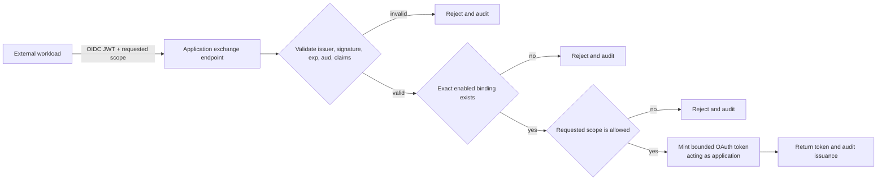

# Org-Scoped Workload Identity for Quay Management API

## 1. Purpose

Enable an organization administrator to configure an OAuth application as a
non-human, org-scoped workload identity. A workload presents an externally
issued OIDC JWT to that application's exchange endpoint and receives a
short-lived Quay OAuth access token that acts as the application.

This eliminates the need for Management API automation to use a human account,
a dummy LDAP/AD user, a stored OAuth token, or the shared bootstrap-token
owner. It also extends keyless federation beyond robot accounts, whose
registry push/pull authorization does not cover Quay Management API operations.

This proposal is deliberately **not** an instance-wide bootstrap feature. It
does not use `BOOTSTRAP_TOKEN_OWNER`, a superuser, the reserved bootstrap
application, or bootstrap token provisioning/renewal. Existing programmatic
bootstrap remains a separate, compatible feature.

## 2. Goals and non-goals

### Goals

- Let organization administrators configure one OAuth application to trust one
  or more external workload identities.
- Support Kubernetes ServiceAccount JWTs first while using a generic OIDC
  issuer and exact-claims model that can support other OIDC workload issuers.
- Issue a normal, short-lived Quay OAuth access token whose actor is the
  configured OAuth application, never a login-capable Quay user.
- Make the application's configured allowed Quay OAuth scopes the authority
  boundary; the exchange request may only narrow those scopes.
- Restrict an application's authority to its owning organization.
- Reuse standard OAuth token expiry, validation, revocation, audit, and token
  inventory behavior where applicable.
- Provide organization-admin APIs and UI to configure bindings and manage the
  resulting credentials.

### Non-goals

- Replacing human authentication or existing OAuth authorization-code flows.
- Replacing programmatic bootstrap or migrating existing bootstrap users.
- Using Kubernetes RBAC, `TokenReview`, or `SubjectAccessReview` to derive
  Quay permissions.
- Allowing wildcard claim matching in the initial release.
- Making an OAuth application's client secret a Management API credential.
- Supporting refresh tokens or OAuth actor/delegation tokens in the initial
  exchange profile.

## 3. Terminology and authorization model

An **OAuth application** remains an OAuth client for existing flows. When an
org admin explicitly enables workload identity on it, it also becomes a
**WIF application principal**, but only for access tokens issued through a
configured workload-identity binding.

A **binding** is an org-admin-owned rule on a WIF application. It contains an
OIDC issuer, audience requirement, exact claims matcher, allowed Quay OAuth
scope string, maximum token lifetime, and enabled state. One application can
have multiple bindings for separate workloads and issuers.

The configured scope string is the application's application-local grant. The
requested scope in an exchange is an additional restriction:

```text
effective scope = requested scopes ∩ binding allowed scopes
```

If `scope` is omitted, the effective scope is the binding's allowed scope set.
An exchange requesting a scope outside the binding is rejected; Quay never
silently broadens the request.

The current Quay OAuth scope vocabulary is used unchanged (for example,
`org:admin`, `repo:create`, `repo:read`, `repo:write`, and `repo:admin`). The
application-principal authorization implementation interprets these scopes in
its owning organization only. It cannot act in another organization, even if a
scope is otherwise broad. Fine-grained, repository-by-repository grants are
out of scope for this initial profile and can build on future fine-grained RBAC
work.

## 4. Organization-owned configuration

Organization administrators configure workload identity through the existing
OAuth Applications experience and corresponding Management API resources.
The organization—not a deployment administrator—owns issuer trust and the
claims-to-scope mapping for its application.

Conceptual configuration for an application named `acme-ci`:

```yaml
workload_identity:
  enabled: true
  bindings:
    - issuer: "https://kubernetes.default.svc"
      audiences: ["quay"]
      claims:
        sub: "system:serviceaccount:ci:tekton-pipeline"
      allowed_scopes: "repo:create repo:read repo:write"
      max_token_ttl_seconds: 900
    - issuer: "https://token.actions.githubusercontent.com"
      audiences: ["quay"]
      claims:
        sub: "repo:acme/release:ref:refs/heads/main"
      allowed_scopes: "repo:read"
      max_token_ttl_seconds: 600
```

The binding schema is generic OIDC: Kubernetes ServiceAccounts are represented
by their ordinary `sub` claim rather than a Kubernetes-specific `SUBJECT`
field. The initial release matches configured claim names and values exactly;
no globbing, regular expressions, or implicit namespace/organization mappings
are permitted.

Issuer configuration is untrusted tenant input. The implementation must:

- require HTTPS and a syntactically valid issuer URL;
- retrieve discovery metadata and keys only through a hardened, bounded HTTP
  client: strict timeouts, response-size limits, no redirects, and safe DNS/IP
  resolution;
- require the discovery document's `issuer` to exactly match the configured
  issuer after defined normalization, and obtain keys only from its validated
  `jwks_uri`;
- cache discovery and JWKS data with bounded per-issuer memory and refresh
  behavior, including refresh on a new signing-key ID;
- apply deployment-level egress/allow controls to prevent SSRF while allowing
  an administrator to explicitly permit legitimate in-cluster issuer endpoints
  such as Kubernetes API servers; and
- audit binding and issuer configuration mutations without recording secrets.

These deployment controls are security guardrails, not a requirement for a
platform administrator to register every tenant issuer before use.

## 5. Exchange API

Each enabled application exposes an application-specific token-exchange
endpoint:

```http
POST /api/v1/organization/{orgname}/applications/{client_id}/workload-identity/exchange
Content-Type: application/x-www-form-urlencoded
```

The endpoint is not protected by an existing Quay bearer token or session. The
presented external JWT is the credential being authenticated. The path selects
the organization and WIF application; possession of an OAuth client secret is
not required and must not substitute for JWT validation.

The request follows an RFC 8693-aligned profile:

- `grant_type` (required): `urn:ietf:params:oauth:grant-type:token-exchange`
- `subject_token` (required): externally issued OIDC workload JWT
- `subject_token_type` (required):
  `urn:ietf:params:oauth:token-type:jwt`
- `scope` (optional): requested space-delimited Quay scopes
- `audience` and `resource` (optional): accepted only when they meet the
  profile's target-service validation rules

Example:

```http
POST /api/v1/organization/acme/applications/CLIENT_ID/workload-identity/exchange
Content-Type: application/x-www-form-urlencoded

grant_type=urn%3Aietf%3Aparams%3Aoauth%3Agrant-type%3Atoken-exchange&subject_token=eyJ...&subject_token_type=urn%3Aietf%3Aparams%3Aoauth%3Atoken-type%3Ajwt&scope=repo%3Aread%20repo%3Awrite
```

A successful response is non-cacheable:

```http
HTTP/1.1 200 OK
Cache-Control: no-store
Pragma: no-cache
Content-Type: application/json

{
  "access_token": "quay-oauth-token-value",
  "issued_token_type": "urn:ietf:params:oauth:token-type:access_token",
  "token_type": "Bearer",
  "expires_in": 900,
  "scope": "repo:read repo:write"
}
```

## 6. Exchange processing


```mermaid
flowchart LR
    W[External workload] -->|OIDC JWT + requested scope| E[Application exchange endpoint]
    E --> V{Validate issuer, signature, exp, aud, claims}
    V -->|invalid| R1[Reject and audit]
    V -->|valid| B{Exact enabled binding exists}
    B -->|no| R2[Reject and audit]
    B -->|yes| S{Requested scope is allowed}
    S -->|no| R3[Reject and audit]
    S -->|yes| T[Mint bounded OAuth token\nacting as application]
    T --> A[Return token and audit issuance]
```

Quay must verify JWT signature, expiration, issuer, and configured audience
before evaluating a binding. It then exact-matches all configured claims and
computes the effective scope. Token lifetime is the minimum of the binding's
maximum TTL, the server's global safety cap, and the remaining lifetime of the
validated subject token.

No mapping means no access. A valid external JWT never receives Quay authority
implicitly.

## 7. Application principal and token persistence

Existing OAuth tokens currently require an `authorized_user`, and Quay derives
its authorization identity from that user. This feature introduces an
application-backed OAuth token subject for WIF-issued tokens instead:

- a WIF token is associated with its existing `OAuthApplication` and the exact
  binding that minted it;
- it has no human or robot `authorized_user`;
- the auth context resolves it to an application principal scoped to the
  application's owning organization;
- authorization checks use the effective OAuth scope string under the
  application-principal rules; and
- conventional OAuth tokens retain their current user-backed behavior.

This requires a deliberate data-model/auth-context change, rather than a
hidden dummy user. A binding relationship (or equivalent durable binding ID)
must be retained on issued WIF tokens so Quay can identify and revoke every
unexpired token minted by that binding.

Token metadata and audit events retain safe workload provenance, for example:

```json
{
  "kind": "workload_identity",
  "organization": "acme",
  "application_client_id": "CLIENT_ID",
  "binding_id": "BINDING_ID",
  "issuer": "https://kubernetes.default.svc",
  "subject": "system:serviceaccount:ci:tekton-pipeline"
}
```

Quay must never store or log the external JWT or the returned access-token
secret.

## 8. Lifecycle, revocation, and UI

The first release includes Organization → OAuth Applications UI changes. An org
admin can:

- enable or disable workload identity for an application;
- create, view, edit, and remove bindings;
- configure issuer, audience, exact claims, allowed scopes, and maximum TTL;
- see WIF-issued token metadata and provenance separately from user-issued
  application tokens; and
- revoke individual issued tokens.

The Management API exposes matching organization-admin resources for
configuration and automation. Mutations are audited.

Disabling, deleting, or materially changing a binding immediately revokes all
unexpired tokens issued by that binding and blocks new exchanges. Deleting or
disabling the WIF application likewise prevents issuance and revokes its
WIF-issued tokens. Normal expiry remains an additional safety boundary.

## 9. Compatibility and rollout

- The feature is additive and off by default until its schema, APIs, UI, and
  security controls are available.
- Existing OAuth clients, user-backed OAuth tokens, robot federation, and
  programmatic bootstrap continue to work without behavior changes.
- Existing bootstrap credentials may coexist with org-scoped WIF, but this
  feature neither depends on nor changes them.
- Kubernetes ServiceAccount issuers are supported first; the binding schema is
  intentionally generic so other OIDC workload issuers do not require a new
  configuration model.

## 10. Test plan and acceptance criteria

### Unit and integration coverage

- Validate discovery/JWKS caching, issuer consistency, signing-key rotation,
  signature, expiration, audience, and exact-claim matching.
- Verify malformed, expired, wrong-issuer, wrong-audience, and unauthorized
  JWTs fail closed without creating a token.
- Verify scope intersection, application-org isolation, and token TTL bounds.
- Verify a WIF token resolves to the application principal, not a user or
  robot, and can perform only the effective permitted Management API actions.
- Verify conventional user-backed OAuth tokens continue to resolve and
  authorize unchanged.
- Verify binding disablement, deletion, and material update revoke all of that
  binding's unexpired tokens atomically.
- Verify no bearer credential is emitted in application logs or audit events.

### End-to-end coverage

- An org admin configures a WIF-enabled application and multiple bindings in
  the OAuth Applications UI.
- A matching Kubernetes workload exchanges a projected ServiceAccount JWT and
  successfully performs allowed Management API operations in that organization.
- A second matching external OIDC workload can use another binding on the same
  application.
- A workload cannot use the token outside the configured scope or organization.
- Editing or disabling a binding invalidates its already-issued token and
  prevents a subsequent exchange.
- Existing bootstrap, human OAuth, and robot-federation flows remain
  unaffected.

The shipping bar is:

> An organization administrator can configure one OAuth application as a
> non-human workload principal; each explicitly bound external workload can
> obtain a short-lived, scoped token for that application, while unbound
> workloads and all authority outside the owning organization are reliably
> denied.
